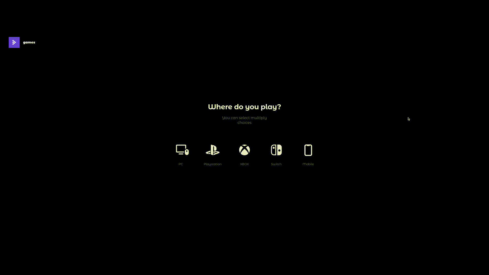

# Проект Games (frontend) - в стадии разработки

[Ссылка на проект на Vercel](https://games-olive.vercel.app/)  

  

## О проекте
Games - это платформа для общения людей и их взаимодействия друг с другом на тему видео-игр. Каждый пользователь может создать себе профиль, в котором будет создавать записи и заметки об играх, добавлять себе друзей, создавать общие чаты, читать новости о последних новинках и многом другом, касающемся видео-игр.  

### Реализовано:  
✔ Верстка по макету Figma, файловая структура по БЭМ, верстка адаптивная с контрольными точками для экранов шириной 375px (mobile) и 1200px (desktop).  
✔ Стартовая страница с анимированным фоном и всплывающим по нажатию кнопки блоком с плейлистом трейлеров на ожидаемые игры + навигационный блок со ссылками на вспомогательную информацию и страницы регистрации/авторизации на сервисе для desktop экранов;  
✔ Страницы регистрации и входа в аккаунт, сброса пароля;  
✔ Страница выбора игровых платформ пользователя - за каждой платформой закреплен цвет, который добавляется/удаляется из анимированного фона в зависимости от выбора пользователя;  
  
✔ Страница выбора видео-игр, интересующих пользователя, с возможностью поиска;  
✔ Страница с выбором подписки на сервис и формой для оплаты;  
✔ Анимированный фон для ряда страниц с опускающимися полосами - создан компонент, принимающий на вход массив возможных цветов полос, а высота, ширина, прозрачность и позиционирование полос строятся рандомно с помощью JS; 

### В работе:  
* Основная страница с боковой панелью, списком новостей и листом друзей;  

### Запланировано реализовать:  
* Страница с профилем пользователя;  
* Страница с информацией для отдельной игры;  
* Страница создания новости/статьи;  
* Страница с чатами;  
* Страница с настройками;  
* Подключение Redux Toolkit для хранения информации по данными пользователя, играм, новостям;

### Стек:

* React
* JSX
* CSS

## Директории

`/components` — папка с компонентами приложения  
`/images` — папка с изображениями  
`/utils` - папка с файлами констант и настроек конфигурации  
`/vendor` - папка с кодом и файлами сторонних разработчиков (включая шрифты)   
`/hooks` - папка с кастомными хуками  

## Установка зависимостей и запуск проекта

##### `npm i` – установить зависимости

##### `npm run start` – запуск devServer на http://localhost:3000/

##### `npm run build` – production сборка проекта
